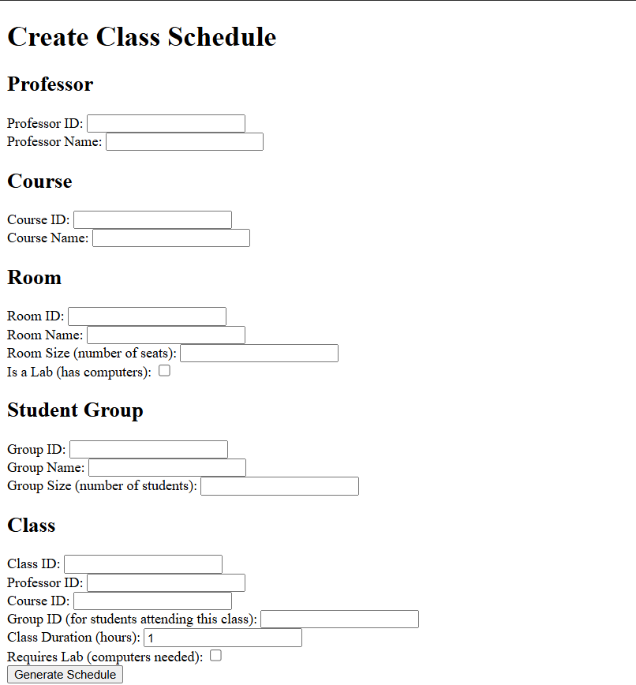
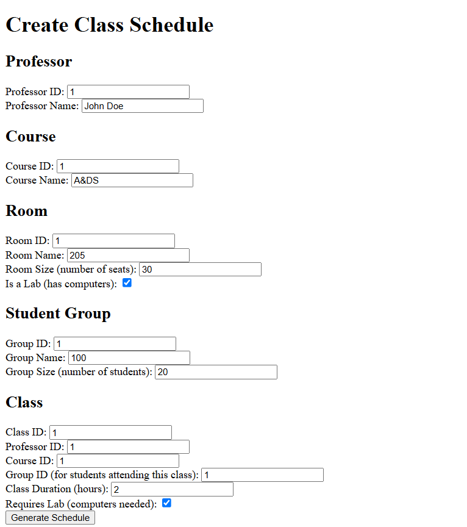
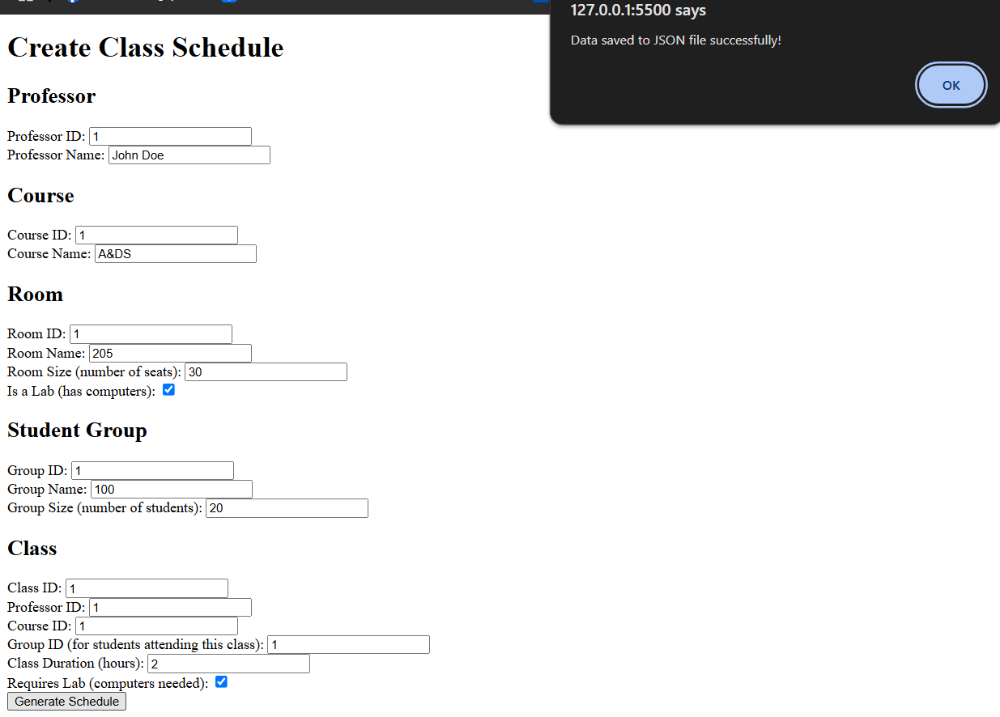
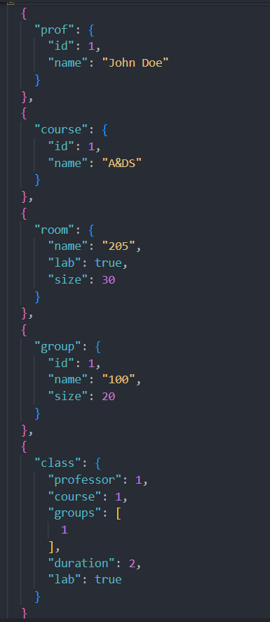

# GASchedule.cs
Making a Class Schedule Using a Genetic Algorithm

# Introduction
Making a class schedule is one of those NP hard problems. The problem can be solved using a heuristic search algorithm to find the optimal solution, but it only works for simple cases. For more complex inputs and requirements, finding a considerably good solution can take a while, or it may be impossible. This is where genetic algorithms come in to the game. In this article, I assume that you are familiar with the basic concepts of genetic algorithms, and I won't describe them in detail because it has been done so many times before.

# Background
When you make a class schedule, you must take into consideration many requirements (number of professors, students, classes and classrooms, size of classroom, laboratory equipment in classroom, and many others). These requirements can be divided into several groups by their importance. Hard requirements (if you break one of these, then the schedule is infeasible):

A class can be placed only in a spare classroom.
No professor or student group can have more then one class at a time.
A classroom must have enough seats to accommodate all students.
To place a class in a classroom, the classroom must have laboratory equipment (computers, in our case) if the class requires it.
Some soft requirements (can be broken, but the schedule is still feasible):

Preferred time of class by professors.
Preferred classroom by professors.
Distribution (in time or space) of classes for student groups or professors.
Hard and soft requirements, of course, depend on the situation. In this example, only hard requirements are implemented. Let's start by explaining the objects which makes a class schedule.

# Objects of Class Schedule
Professor
The Professor class has an ID and the name of the professor. It also contains a list of classes that a professor teaches.

Students Group
The StudentsGroup class has an ID and the name of the student group, as well as the number of students (size of group). It also contains a list of classes that the group attends.

Classroom
The Room class has an ID and the name of the classroom, as well as the number of seats and information about equipment (computers). If the classroom has computers, it is expected that there is a computer for each seat. IDs are generated internally and automatically.

Course
The Course class has an ID and the name of the course.

Class
CourseClass holds a reference to the course to which the class belongs, a reference to the professor who teaches, and a list of student groups that attend the class. It also stores how many seats (sum of student groups' sizes) are needed in the classroom, if the class requires computers in the classroom, and the duration of the class (in hours).

Chromosome
The first thing we should consider when we deal with a genetic algorithm is how to represent our solution in such a way that it is feasible for genetic operations such as crossover and mutation. Also, we should know how to specify how good our solution is. In other words, we should be able to calculate the fitness value of our solution.

Representation
How can we represent the chromosome for a class schedule? Well, we need a slot (time-space slot) for each hour (we assume that time is in one hour granules), for every room, every day. Also, we assume that classes cannot begin before 9am, and should finish before or at 9pm (12 hours total), and working days are from Monday to Friday (5 days total).
The result will be displayed in form of HTML table. The program would open the default browser to well arranged the course class timetable.
</p>

# Fitness
Now we need to assign a fitness value to the chromosome. As I previously said, only hard requirements are used to calculate the fitness of a class schedule. This is how we do it:

Each class can have 0 to 5 points.
If a class uses a spare classroom, we increment its score.
If a class requires computers and it is located in the classroom with them, or it doesn't require them, we increment the score of the class.
If a class is located in a classroom with enough available seats, guess what, we increment its score.
If a professor has no other classes at the time, we increment the class's score once again.
The last thing that we check is if any of the student groups that attend the class has any other class at the same time, and if they don't, we increment the score of the class.
If a class breaks a rule at any time-space slot that it occupies, its score is not incremented for that rule.
The total score of a class schedule is the sum of points of all classes.
The fitness value is calculated as schedule_score/maximum_score, and maximum_score is number_of_classes*5.
The fitness values are represented by single-precision floating point numbers (float) in the range 0 to 1.

# Crossover
A crossover operation combines data in the hash maps of two parents, and then it creates a vector of slots according to the content of the new hash map. A crossover 'splits' hash maps of both parents in parts of random size. The number of parts is defined by the number of crossover points (plus one) in the chromosome's parameters. Then, it alternately copies parts form parents to the new chromosome, and forms a new list of slots.

# Mutation
A mutation operation is very simple. It just takes a class randomly and moves it to another randomly chosen slot. The number of classes which are going to be moved in a single operation is defined by the mutation size in the chromosome's parameters.

# Algorithm
The genetic algorithm is fairly simple. For each generation, it performs two basic operations:

Randomly selects N pairs of parents from the current population and produces N new chromosomes by performing a crossover operation on the pair of parents.
Randomly selects N chromosomes from the current population and replaces them with new ones. The algorithm doesn't select chromosomes for replacement if it is among the best chromosomes in the population.
And, these two operations are repeated until the best chromosome reaches a fitness value equal to 1 (meaning that all classes in the schedule meet the requirement). As mentioned before, the genetic algorithm keeps track of the M best chromosomes in the population, and guarantees that they are not going to be replaced while they are among the best chromosomes.

# Configuration JSON File
Types of objects:

professor - describes a professor.<br />
course - describes a course.<br />
room - describes a room.<br />
group - describes a students group.<br />
class - describes a class, and binds the professor, course, and students group.<br />

prof:<br />
id (number, required) - ID of the professor.<br />
name (string, required) - name of the professor.<p />
course:<br />
id (number, required) - ID of the course.<br />
name (string, required) - name of the course.<p />
room:<br />
name (string, required) - name of the room.<br />
size (number, required) - number of seats in the room.<br />
lab (boolean, optional) - indicates if the room is a lab (has computers); if not specified, the default value is false.<p />
group:<br />
id (number, required) - ID of the students group.<br />
name (string, required) - name of the students group.<br />
size (number, required) - number of students in the group.<p />
class:<br />
professor (number, required) - ID of a professor; binds a professor to a class.<br />
course (number, required) - ID of a course; binds a course to a class.<br />
group (number, required) - ID of a students group; binds the students group to a class; each class can be bound to multiple students groups.<br />
duration (number, optional) - duration of class (in hours); if not specified, the default value is 1.<br />
lab (boolean, optional) - if the class requires computers in a room; if not specified, the default value is false.<br />

Note that the professor, students group, and course objects must be defined before they are bound to a course class object.

# How to call this api
If you are using C#, you would call GASchedule as follows:

```cs
    var configuration = new GaSchedule.Algorithm.Configuration();
    configuration.ParseFile("./GaSchedule.json");

    var alg = new Cso<Schedule>(new Schedule(configuration));
    alg.Run();
    var htmlResult = HtmlOutput.GetResult(alg.Result);
```
For Json output:
```cs
    var configuration = new GaSchedule.Algorithm.Configuration();
    configuration.ParseFile("./GaSchedule.json");

    var alg = new Ngra<Schedule>(new Schedule(configuration));
    alg.Run();
    var jsonResult = JsonOutput.GetResult(alg.Result);
```

# Class Schedule Generator with Genetic Algorithm

This project is a web application that allows users to enter details for professors, courses, rooms, student groups, and classes via an HTML form. It saves the entered data to a JSON file, which can be used as input for a genetic algorithm-based class scheduling system.

## Features

- Form-based input for scheduling data: professor, course, room, group, and class details.
- Saves form data to a JSON file on the server.
- Ready for use with a genetic algorithm to generate optimized class schedules.

## Prerequisites

To get started, make sure you have the following installed:

- **Node.js** (for running the server)
- **Express.js**: Node.js framework for handling requests
- **Cors**: Middleware to handle Cross-Origin Resource Sharing

## Getting Started

### 1. Clone the Repository

Clone this repository to your local machine:
```bash
git clone https://github.com/username/ClassScheduleGA.git
```

### 2. Install Required Packages

Navigate to the project directory and install the required packages by running:
```bash
npm install express cors
```

### 3. Run the Server

Start the server by running:
```bash
node server.js
```

This will start the server at [http://localhost:3000](http://localhost:3000).

### 4. Open the HTML Form

Open `index.html` in your web browser to view the form and enter scheduling data.

### 5. Submit Form Data

- Fill out all required fields in each section (Professor, Course, Room, Group, Class).
- Click **Generate Schedule** to submit the form.
- The data will be sent to the server and saved to `user_data.json`.

> **Note**: Ensure the server is running before clicking the submit button to save data successfully.

### File Structure

- **index.html**: The main HTML file with the form for entering schedule data.
- **script.js**: JavaScript file to handle form submission and send data to the server.
- **server.js**: Node.js server file to receive and save data as a JSON file.

---

### Screenshots

HTML form before user enters any data

Form filled in

Message pops up after JSON file successfully generated

Generated JSON file


Let me know if you need any adjustments!
